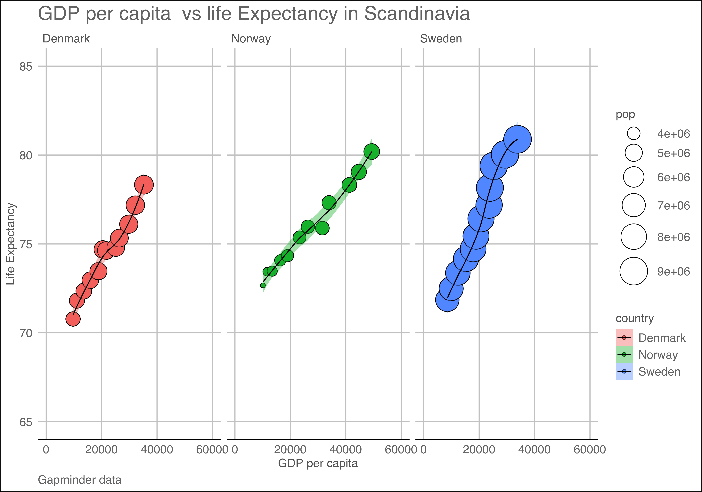

Homework 05: Factor and figure management
================
Adam Mattsson
2018-10-12

Load required packages (and suppress package startup messages):

``` r
suppressPackageStartupMessages(library(gapminder))
suppressPackageStartupMessages(library(knitr))
suppressPackageStartupMessages(library(readr))
suppressPackageStartupMessages(library(tidyverse))
suppressPackageStartupMessages(library(forcats))
suppressPackageStartupMessages(library(ggplot2))
suppressPackageStartupMessages(library(ggthemes))
```

Factor management
=================

### Step goals:

-   Drop factor/levels;
-   Reorder levels based on knowledge from data.

For this part of the assignment I chosed to work on the `gapminder` dataset.

**Drop Oceania** Filter the Gapminder data to remove observations associated with the `continent` of Oceania. Additionally, remove unused factor levels. Provide concrete information on the data before and after removing these rows and Oceania; address the number of rows and the levels of the affected factors.

First, lets see how many levels we have in the `continent` factor by calling `levels()` as such:

``` r
levels(gapminder$continent)
```

    ## [1] "Africa"   "Americas" "Asia"     "Europe"   "Oceania"

Now it's time to get rid of the "Oceania" level in the `continent` factor. This is achieved by filtering the dataset.

``` r
filtered.gapminder <- gapminder %>% 
  filter(continent != "Oceania" )
```

We can easily inspect the levels of the factors to see if we succesfully got rid of the Oceania data by utilizing the following chunk of code:

``` r
table(filtered.gapminder$continent)
```

    ## 
    ##   Africa Americas     Asia   Europe  Oceania 
    ##      624      300      396      360        0

As we can see we have sucesfully removed all the data from the Oceania level. However, the level is still present and we can remove this unused factor level by calling the following code:

``` r
filtered.gapminder.oceania <- droplevels(filtered.gapminder)
```

To inspect the factor once again we call the following code:

``` r
table(filtered.gapminder.oceania$continent)
```

    ## 
    ##   Africa Americas     Asia   Europe 
    ##      624      300      396      360

All the data from the Oceania level has now been removed, as well the unused factor level.

**Reorder the levels of `country` or `continent`.**

Use the forcats package to change the order of the factor levels, based on a principled summary of one of the quantitative variables. Consider experimenting with a summary statistic beyond the most basic choice of the median.

For this part of the assignment I chosed to re-order `gapminder` countries by minimum GDP per capita. The first four countries with the lowest GDP per capita are returned.

``` r
factor.reorder <- fct_reorder(gapminder$country, gapminder$gdpPercap, min) %>%
  levels()
knitr::kable(head(factor.reorder,n=4),col.names = 
        c('Country'),
        format = 'html',
        caption = "<h4>Top four countries with the lowest GDP per capita</h4>")
```

<table>
<caption>
<h4>
Top four countries with the lowest GDP per capita
</h4>
</caption>
<thead>
<tr>
<th style="text-align:left;">
Country
</th>
</tr>
</thead>
<tbody>
<tr>
<td style="text-align:left;">
Congo, Dem. Rep.
</td>
</tr>
<tr>
<td style="text-align:left;">
Lesotho
</td>
</tr>
<tr>
<td style="text-align:left;">
Guinea-Bissau
</td>
</tr>
<tr>
<td style="text-align:left;">
Eritrea
</td>
</tr>
</tbody>
</table>
Here are some other useful ways in which you can reorder levels of a factor:

``` r
#by frequency
t1 <- filtered.gapminder.oceania
t1$continent %>% 
  fct_infreq() %>% 
  levels()
```

    ## [1] "Africa"   "Asia"     "Europe"   "Americas"

``` r
#by median gdp per cap
t1$continent %>% 
  fct_reorder(t1$gdpPercap) %>% 
  levels()
```

    ## [1] "Africa"   "Asia"     "Americas" "Europe"

``` r
#flip order, highest gdpPercap continent appears first
t1$continent %>% 
  fct_reorder(t1$gdpPercap, .desc = TRUE) %>% 
  levels()
```

    ## [1] "Europe"   "Americas" "Asia"     "Africa"

**Common part**

If we want to write and read this data to a file I can use the following code:

``` r
readr::write_csv(t1, "test.csv")
```

**Explore the effects of arrange(). Does merely arranging the data have any effect on, say, a figure?**

First, lets create a new dataset for this part of the assignment. We can create a new dataset from the original gapminder, lets say life expectancy for European countries in 2007.

``` r
t2 <- gapminder %>% 
  filter(year == 2007, continent == "Europe") %>%
  select(year,lifeExp,country)
knitr::kable(head(t2, n = 10))
```

|  year|  lifeExp| country                |
|-----:|--------:|:-----------------------|
|  2007|   76.423| Albania                |
|  2007|   79.829| Austria                |
|  2007|   79.441| Belgium                |
|  2007|   74.852| Bosnia and Herzegovina |
|  2007|   73.005| Bulgaria               |
|  2007|   75.748| Croatia                |
|  2007|   76.486| Czech Republic         |
|  2007|   78.332| Denmark                |
|  2007|   79.313| Finland                |
|  2007|   80.657| France                 |

If we want to arrange the lifeExp data in descending order we can call the `arrange()` function.

``` r
t2.arrange <- gapminder %>% 
  filter(year == 2007, continent == "Europe") %>%
  select(year,lifeExp,country) %>%
  arrange(desc(lifeExp))
knitr::kable(head(t2.arrange, n = 10))
```

|  year|  lifeExp| country     |
|-----:|--------:|:------------|
|  2007|   81.757| Iceland     |
|  2007|   81.701| Switzerland |
|  2007|   80.941| Spain       |
|  2007|   80.884| Sweden      |
|  2007|   80.657| France      |
|  2007|   80.546| Italy       |
|  2007|   80.196| Norway      |
|  2007|   79.829| Austria     |
|  2007|   79.762| Netherlands |
|  2007|   79.483| Greece      |

We can then plot the two datasets and compare them.

``` r
ggplot(t2, aes(x = lifeExp, y = country)) + geom_point() + 
  labs(title = "Plot before arrangeing lifeExp in descending order")
```


``` r
ggplot(t2.arrange, aes(x = lifeExp, y = country)) + geom_point()+ 
  labs(title = "Plot after arrangeing lifeExp in descending order")
```


As we can see there is no difference in the two plots. If we want to rearange the order factor levels (countries by lifeExp) we need to implement the `fct_reorder`function, as such:

``` r
ggplot(t2, aes(x = lifeExp, y = fct_reorder(country, lifeExp))) +
  geom_point()
```


As we can observe in this last plot, the orders of the factor levels has been reordered and gives us a better visualization of the data. In other words, `arrange()` alone does not have any effect on the presented figures and the use of `forcats` package could help us in our task.

File I/O
========

Another way of saving/reading files from R is by using TSV. As such:

``` r
readr::write_tsv(t2.arrange, "test.tsv")
```

Visualization design
====================

For this part of the task I decided to plot GDP per capita vs life expectancy in Scandinavian countries. The bubble size corresponds to the

``` r
bp <- gapminder %>%
  filter(country %in% c('Sweden', 'Denmark', 'Norway')) %>% 
  ggplot(aes(x = gdpPercap, y = lifeExp))+
  geom_point(aes(size = pop), pch = 21, show.legend = TRUE) +
  scale_size_continuous(range = c(2, 13)) +
  facet_wrap(~ country) +
  ylim(c(65,85)) +
  xlim(c(0,60000)) +
  aes(fill = country) +
  geom_smooth(method='loess',size=0.5, colour='black') + 
  labs(title = 'GDP per capita  vs life Expectancy in Scandinavia', x = 'GDP per capita', y = 'Life Expectancy', caption = 'Gapminder data') +
  theme_gdocs()
bp
```


Writing figures to files
========================

In order to write a figure to a file we can use the `ggsave()` function. we can also specify the diemensions of the output file in this function. The last part of this assignment is to embed the figure into the report. This is achieved by using ``

``` r
ggsave("GDPperCap_vs_LifeExpectancy_Scandinavia.png",
  plot = bp, 
  device = "png",
  width = 10, 
  height = 7,
  dpi = 500)
```


